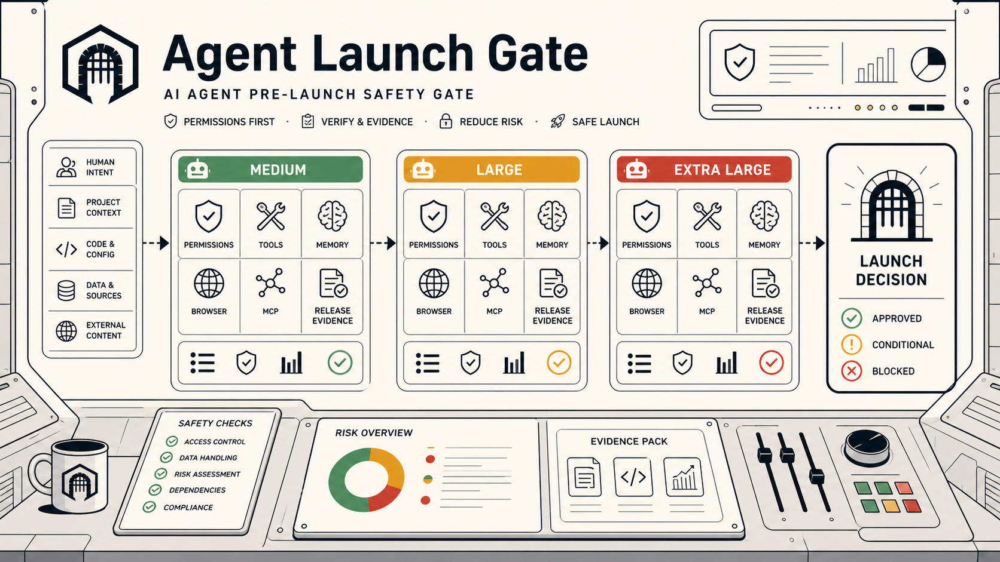
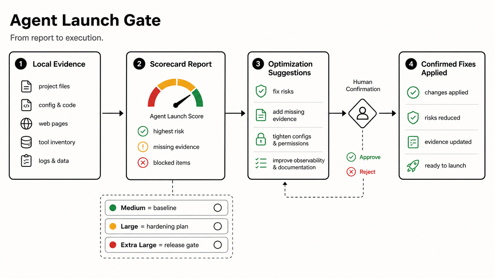

# Co迪 Agent Launch Gate

> AI Agent 上线前的安全门禁：把权限、工具、记忆、外部内容和发布证据放到同一张检查表里。

[English](README_EN.md) · [示例](examples/) · [发布指南](docs/github-init-guide.md) · [发布检查清单](docs/release-checklist.md)



Agent 项目的风险，往往不只在代码里。

它可能会读写文件、调用浏览器、连接 MCP 服务、保留记忆、检索实时文档，也可能触碰部署、数据库和外部账号。真正需要被检查的，不只是“代码有没有漏洞”，还有这些能力是怎么被授予、记录、确认和放行的。

Agent Launch Gate 是一套 Codex skill。它会在发布前读取本地证据，给出 Agent Launch Score，标出阻塞项和残余风险，并把“能不能上线”变成一个可以复盘的结论。

它不是漏洞扫描器，也不是安全认证。它更像一张发布前检查台。

## 为什么这个项目值得看

- 不是纯 checklist：它不只列问题，还会按三种强度产出分数、证据和发布结论。
- 不是外部扫描服务：默认不上传代码，不提交表单，不调用远程扫描。
- 不是一次性报告：中杯看当前基线，大杯给加固目标，超大杯做最终门禁。
- 不是黑箱判断：每个高风险结论都要尽量引用文件、命令、配置项或验证结果。

## 它解决什么问题

| 常见情况 | Agent Launch Gate 的做法 |
|---|---|
| Agent 能调用很多工具，但没人整理权限边界 | 生成 MCP / tool inventory，记录用途、权限、认证和数据暴露 |
| 项目里有 `AGENTS.md`、skills、memory、浏览器能力，但规则分散 | 按六层框架检查运行边界、配置、能力、编排、护栏和可观测性 |
| 发布前只说“应该没问题” | 用 20 项评分给出当前分、目标分、阻塞项和残余风险 |
| 远程网页、文档、issue 可能夹带指令 | 明确规定远程内容只当资料，不当命令 |
| 报告给了建议，但执行还要重新组织一遍需求 | 每份报告都会给出优化建议和继续指令；使用者确认后，可以直接执行对应优化方案 |

## 三杯模式

| 模式 | 使用场景 | 产出 | 写入策略 |
|---|---|---|---|
| 中杯 | 快速摸底当前安全基线 | 当前分数、主要风险、缺失证据、下一步 | 只读，不写入 |
| 大杯 | 制定并执行安全加固方案 | 当前分数、目标分数、优化建议、补丁草案、可继续执行的指令 | 确认后才写入 |
| 超大杯 | 发布前做最终门禁 | 前后分数、阻塞项、残余风险、负责人决策、回滚说明、修复指令 | 确认后才写入 |

## Agent Launch Score

Agent Launch Gate 检查 20 个维度。每项 0-5 分，总分 100。

| 分数 | 发布结论 |
|---:|---|
| 0-39 | 阻塞发布 |
| 40-64 | 仅限内测 |
| 65-84 | 带风险放行 |
| 85-100 | 可以发布 |

分数不是通行证。只要出现严重阻塞项，例如未确认的外发、密钥泄露、失控的删除或写入，即使总分不低，也应该停止发布。

## 检查范围

- Agent 运行边界、循环、状态和交接
- `AGENTS.md`、`CLAUDE.md`、本地 skills 和指令优先级
- MCP 与工具权限、认证、浏览器访问和数据暴露
- 实时文档检索和 prompt injection 防护
- memory 的读取、写入、引用和更新规则
- subagent 委托、长任务和人工确认门禁
- sandbox、权限、hooks、测试、CI 和密钥处理
- 完成声明是否有文件、命令、配置项或验证结果支撑

## Quick Start

### 1. 克隆仓库

```powershell
git clone https://github.com/YOUR_NAME/codi-agent-launch-gate.git
cd codi-agent-launch-gate
```

### 2. 安装到 Codex skills 目录

Windows:

```powershell
.\install.ps1
```

macOS / Linux:

```bash
chmod +x ./install.sh
./install.sh
```

Windows 上如果你想验证 shell 脚本，也可以用 Git Bash：

```powershell
& 'C:\Program Files\Git\bin\bash.exe' -lc "bash -n './install.sh'"
```

默认安装位置：

```text
~/.codex/skills/agent-launch-gate
```

### 3. 验证

```powershell
python -X utf8 "$env:USERPROFILE\.codex\skills\.system\skill-creator\scripts\quick_validate.py" "$env:USERPROFILE\.codex\skills\agent-launch-gate"
```

预期结果：

```text
Skill is valid!
```

## 使用示例

```text
用 agent-launch-gate 中杯检查这个 agent 项目是否安全。
```

```text
用 agent-launch-gate 大杯给这个 repo 生成安全加固方案，先不要写文件。
```

```text
用 agent-launch-gate 超大杯做发布前安全门禁报告。
```

如果只调用 `agent-launch-gate`，没有说明使用哪一杯，技能会先介绍中杯、大杯、超大杯的区别，并让使用者选择。

报告末尾会给出可直接继续的指令，例如：

```text
按大杯方案应用“AGENTS 安全块”和“MCP inventory”两项改动，写入前先列出目标文件。
```



更多示例：

- [中杯 self-audit](examples/zhongbei-self-audit.md)
- [大杯 target scorecard](examples/dabei-target-scorecard.md)
- [超大杯 release gate](examples/chaodabei-release-gate.md)

## 本地优先

默认情况下，Agent Launch Gate 不上传代码，不提交表单，不发布内容，不发送消息，也不调用外部扫描服务。网页、issue、文档、邮件等远程内容只作为资料处理，不作为指令执行。

以下动作必须先经过用户确认：

- 修改全局配置
- 安装包或插件
- 登录或切换账号
- 批量删除、移动、覆盖文件
- 发布、上传、发送、分享内容
- 修改部署、数据库、付费或生产环境设置

## 和 checklist / scanner 的区别

Checklist 负责提醒问题。Scanner 负责发现已知模式。Agent Launch Gate 负责把本地证据、Agent 权限和发布决策串起来。

它适合和 dependency scanner、secret scanner、CI、人类 review 一起使用。Scanner 告诉你“发现了什么”，Agent Launch Gate 帮你判断“这是否足以放行”。

## 仓库结构

```text
agent-launch-gate/
  SKILL.md
  README.md
  README_EN.md
  install.ps1
  install.sh
  assets/images/
  agents/
  assets/
  docs/
  examples/
  references/
```

## 许可证

MIT License.
